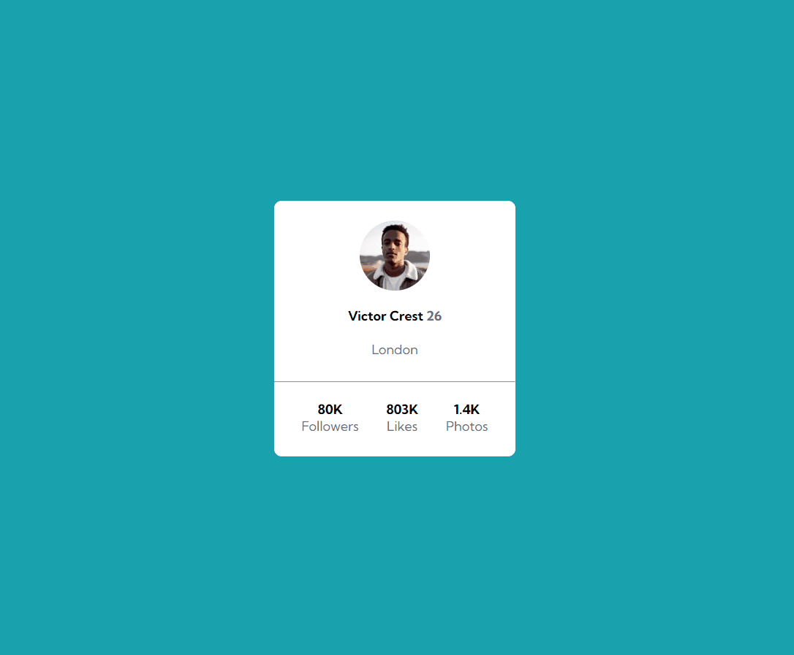

# Projeto Frontend Mentor - Profile card component solution
Exercício realizado como desafio lançado pelo curso DevQuest  
Esse desafio será aprimorado com o andamento do curso🚀

## Tecnologias utilizadas
- HTML
- CSS

-----------------------------------------------

### Coisas que **aprendi**:
1. centralizar elementos na tela;
2. tag < hr >;
3. dividir os arquivos CSS em arquivos separados para facilitar a manutenção do código.

Obs: o arquivo style.css está com comentários explicando o aprendizado.

-----------------------------------------------

### **Dificuldades** enfrentadas
* centralizar o cartão na tela;
* redução da quantidade de div's no HTML.

-----------------------------------------------
### Autor
- Execução do projeto - [Karolline Uchôa](https://github.com/KarollineUchoa) 
- Desafio Profile card component solution - [Frontend Mentor](https://www.frontendmentor.io/challenges/profile-card-component-cfArpWshJ/hub/profile-card-component-6p28wPu8OA)